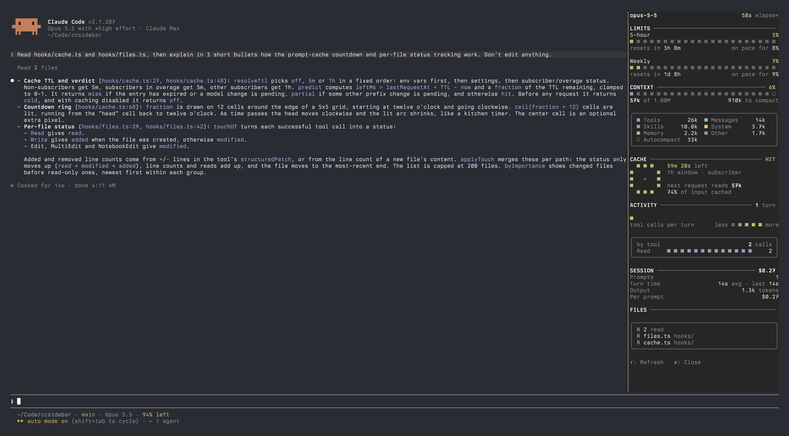

# ccsidebar

A toggle-able right sidebar mod for Claude Code showing usage limits, context
window, prompt-cache countdown, per-turn activity, session stats and touched
files. Colors use your terminal's 16-color palette, so they follow your shell theme.



## Use

- `/sidebar` toggles the pane. `r` refreshes, `x` closes while it has focus.
- Opens on its own at 144+ columns if you left it open last time.

## Install

```
/plugin marketplace add richard-parayno/ccsidebar
/plugin install ccsidebar@ccsidebar
```

## Develop locally

Link the repo into a mods folder and list it in `CLAUDE_CODE_PLUGIN_DIRS` (the
`env` block of `~/.claude/settings.json`; separate several with `:`):

```sh
mkdir -p ~/.claude/mods && ln -s ~/Code/ccsidebar ~/.claude/mods/ccsidebar
```

```json
{ "env": { "CLAUDE_CODE_PLUGIN_DIRS": "~/.claude/mods/ccsidebar" } }
```

The folder is watched: saving a file reloads the mod live. Don't also install
it from the marketplace on the same machine, or two copies load.

## Develop

```sh
claude plugin validate .
claude plugin test .
tsc -p .          # after one load, which lays the types in .claude-plugin/types/
```

| File | What |
| --- | --- |
| `hooks/register.tsx` | hooks and state: usage, context, turns, tools, cache timing |
| `hooks/view.tsx` | the drawing: sections, cards, type scale |
| `hooks/pixels.ts` | box grids and the terminal/theme palettes |
| `hooks/cache.ts` | prompt-cache TTL rule, hit/miss prediction, countdown ring |
| `hooks/files.ts` | per-file status (A/M/R) and line deltas |
| `hooks/format.ts` | numbers, durations, pace |
| `types/index.d.ts` | the `$.state` contract |
